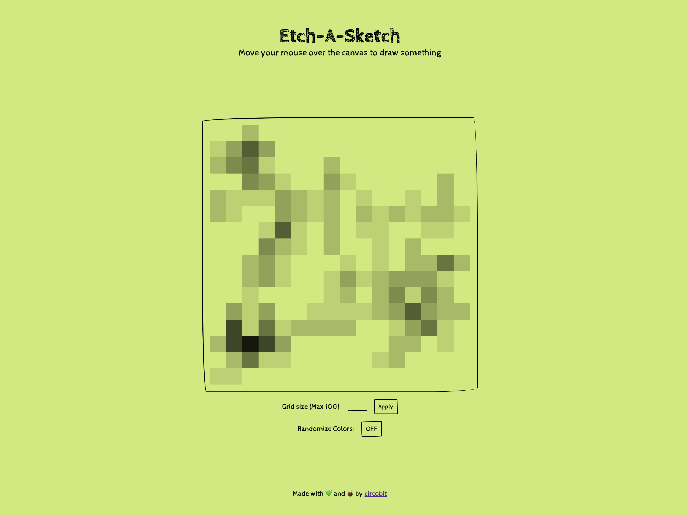

# Etch-A-Sketch

This project is browser-based recreation of the Etch-a-Sketch toy. It's built using mainly JavaScript as part of [The Odin Project curriculum](https://www.theodinproject.com/lessons/foundations-etch-a-sketch). The page renders a 16x16 grid of squares (generated with JavaScript, styled with Flexbox). When the user hovers over a square, the oppacity of the item is increased by 10% each time.

Users can customize their canvas with a size up to 100x100 while keeping the total drawing area constant. It's possible also to set random colors to the items of the grid while keeping the oppacity applied.

## Built with

- HTML
- CSS
- JavaScript

## Demo

[Try It Here](https://circobit.github.io/etch-a-sketch/)

## Screenshot

